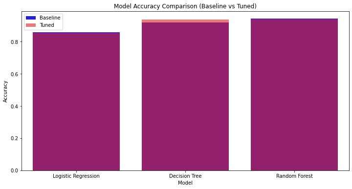
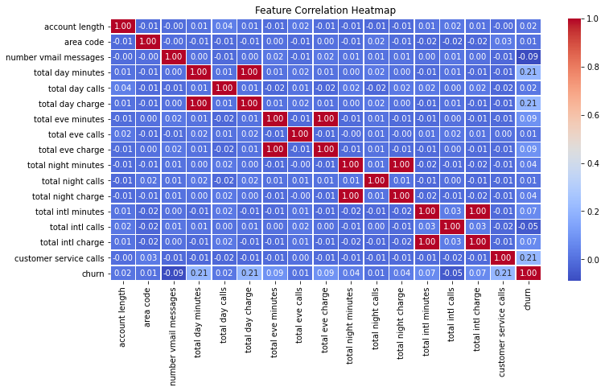
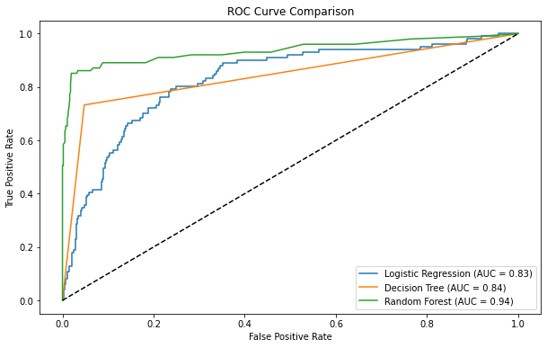

# Phase-3-Project
# **Customer Churn Prediction for a Telecommunications Company

## Project Overview

This project aims to analyze and predict customer churn in a telecommunications company. By leveraging machine learning techniques, we identify key factors influencing churn and develop predictive models to help the company implement proactive customer retention strategies.

## Dataset

* Source: SyriaTel customer dataset

* Key Features: Customer service calls, international plan usage, total call minutes, and other service-related attributes

* Target Variable: Churn (0 = No, 1 = Yes)

## Project Workflow

### Data Collection & Cleaning

Removed unnecessary columns (e.g., phone number, state)

Encoded categorical variables (e.g., international plan, voice mail plan)

Standardized numerical features for better model performance

### Exploratory Data Analysis (EDA)

Visualized churn distribution using count plots

Analyzed correlations between features and churn using heatmaps and boxplots

## Machine Learning Models

Algorithms Used: Logistic Regression, Decision Tree, Random Forest

Performance Metrics: Accuracy, Precision, Recall, F1-score, ROC-AUC

Hyperparameter Tuning: Optimized model performance using GridSearchCV

### Key Findings

Frequent customer service calls strongly correlate with higher churn rates

Customers with high service usage (e.g., international calls, total call minutes) are more likely to churn

The Random Forest model achieved the highest accuracy and best predictive performance

## Recommendations

* Improve customer service interactions to reduce dissatisfaction and churn

* Use predictive modeling to identify at-risk customers early

* Implement personalized retention strategies, such as discounts or loyalty programs, for high-risk customers

## Results & Visualizations

* Model Accuracy Comparison: Bar plots comparing baseline vs. tuned models

* Feature Correlations: Heatmaps showing relationships between features and churn

* ROC Curve Analysis: Performance comparison of all models

